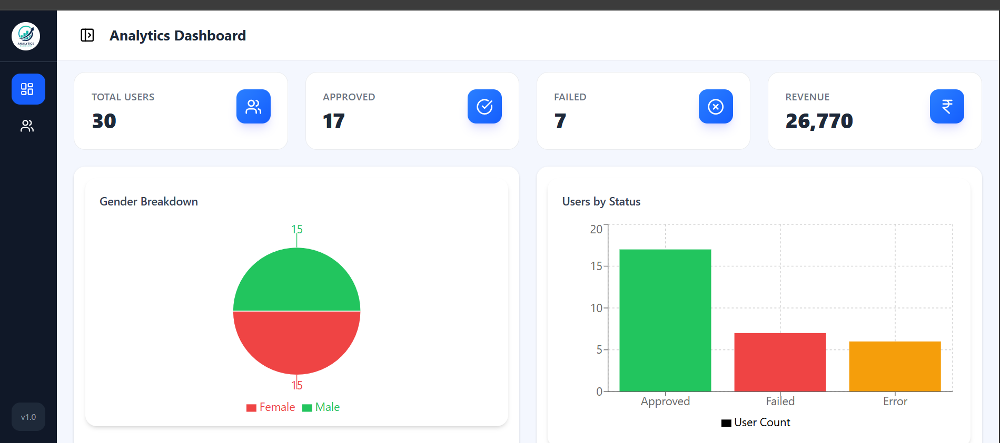
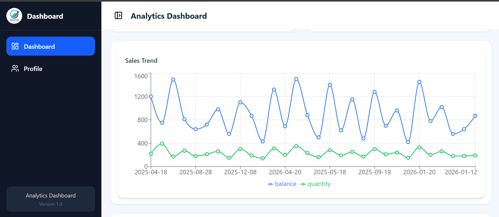
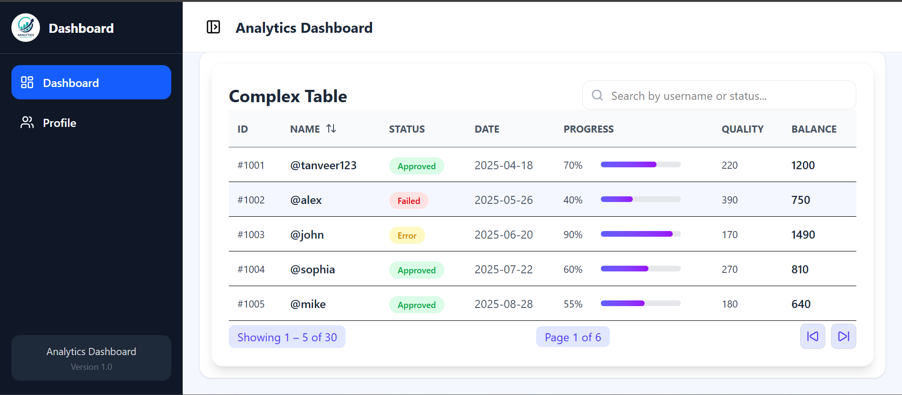
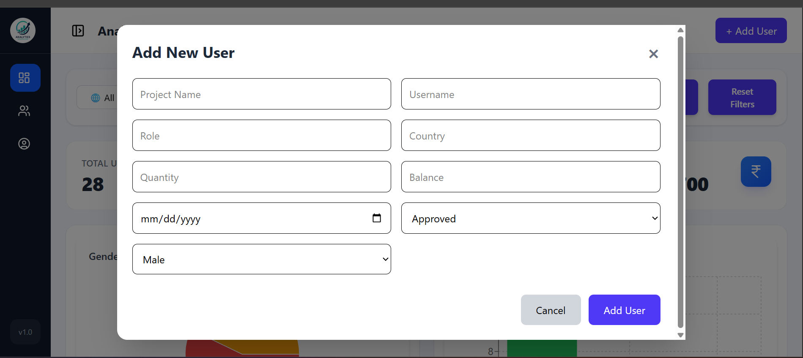

📊 Analytics Dashboard (Intern Project)

A modern and responsive Analytics Dashboard built with React.js, Tailwind CSS, and Recharts. The application initially displays 30 predefined user records and provides complete user management with Add User and Delete User functionality. All user changes are automatically stored using Local Storage, ensuring data persists even after refreshing the page.

🚀 Live Demo

Live Preview:
https://analytics-dashboarddd.netlify.app/

💻 GitHub Repository

Source Code:
https://github.com/tanveerahmed9413/Analytics-Dashboard

# 📸 Screenshots

### Dashboard

### Charts

### User Table

### Add User Modal

 

---

➕ Add User Modal

✨ Features
📊 Dashboard Summary Cards
📈 Interactive Bar Chart
🥧 Interactive Pie Chart
👤 Add New User
🗑️ Delete User
💾 Local Storage Persistence
📋 30 Default User Records
🔍 Global Search
↕️ Table Sorting
📅 Date Range Filter
✅ Status Filter
📄 Pagination
📱 Fully Responsive Design
⚡ Fast Performance
👤 User Management

The dashboard provides complete user management functionality with Add User and Delete User features.

➕ Add User

Users can add a new record through a responsive modal form. Newly added users are automatically saved to Local Storage, ensuring the data remains available even after refreshing the page.

Features
Open Add User Modal
Form Validation
Automatic User ID Generation
Instant User Creation
Automatic Table Update
Dashboard Cards Update
Charts Refresh Automatically
Search Results Update
Pagination Updates Automatically
Data Saved in Local Storage
User Information

Each user record contains:

User ID
User Name
Project Name
Status
Quantity
Balance
Gender
Country
Date

🗑️ Delete User

Users can remove any record directly from the table. Deleted users are permanently removed from Local Storage, and every dashboard component updates instantly.

Features
One Click Delete
Delete Button in Every Row
Instant Record Removal
Automatic Table Refresh
Dashboard Cards Update
Charts Refresh Automatically
Search Results Update
Pagination Recalculation
Local Storage Synchronization
No Page Refresh Required

⚙️ User Management Workflow

➕ Add User Workflow

Click the Add User button.
Fill in the required user details.
Submit the form.
A unique User ID is generated automatically.
The new user is stored in Local Storage.
Dashboard cards update automatically.
Charts refresh instantly.
Search and filters include the new user.
Pagination adjusts automatically.

🗑️ Delete User Workflow

Click the Delete button in the desired row.
The selected user is removed from the dataset.
Updated data is saved to Local Storage.
Dashboard cards refresh automatically.
Charts are recalculated.
Search results update instantly.
Pagination adjusts automatically.

💾 Data Persistence

The dashboard uses Local Storage to maintain data across browser sessions.

Initial Data
Displays 30 predefined user records on the first visit.
Default data loads automatically if Local Storage is empty.
Local Storage Behavior
New users are saved automatically.
Deleted users are permanently removed.
Data persists after page refresh.
Dashboard always loads the latest saved records.
If Local Storage is cleared, the default dataset is loaded again.
📊 Dashboard Modules
📊 Dashboard Cards

The dashboard displays four summary cards:

Total Users
Approved Users
Failed Users
Revenue
Cards Automatically Update After
Adding a User
Deleting a User
Applying Filters
📈 Charts
📊 Bar Chart

Displays the total number of users grouped by their status.

🥧 Pie Chart

Shows the visual distribution of user statuses.

Charts Automatically Update After
Adding a User
Deleting a User
Applying Filters
📋 User Table

The user table provides the following features:

Global Search
Sorting
Pagination
Status Display
Date Display
Dynamic Updates

The table updates instantly whenever user data changes.

🔍 Filters

Users can filter records using:

Status
From Date
To Date
Filter Results
Dashboard Cards Update
Charts Update
Table Updates Automatically
Pagination Recalculates
📄 Pagination

Pagination includes:

Previous Page
Next Page
Page Numbers
Current Record Count

Pagination automatically adjusts after:

Adding Users
Deleting Users
Applying Filters

🛠 Tech Stack

React.js
Tailwind CSS
Recharts
Lucide React

📂 Folder Structure
src
│
├── components
│   ├── Cards
│   ├── Charts
│   ├── Filters
│   ├── Modal
│   ├── Table
│
├── data
│
├── pages
│
├── App.jsx
│
└── main.jsx
📦 Installation

Clone the repository

git clone https://github.com/tanveerahmed9413/Analytics-Dashboard.git

Navigate to the project folder

cd Analytics-Dashboard

npm install

Start the development server

npm run dev

👨‍💻 Author

Tanveer Ahmed

GitHub:
https://github.com/tanveerahmed9413

⭐ Support

If you found this project helpful, please consider giving it a ⭐ Star on GitHub.